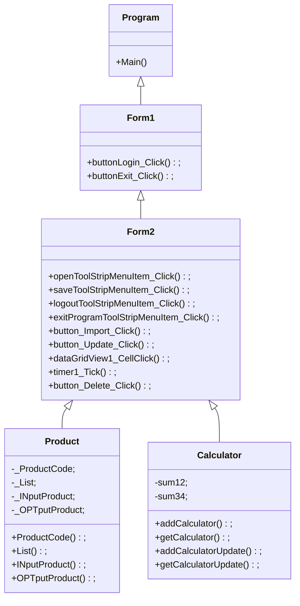

# Final-Project-Assignment-643450079-3

### ความเป็นมาของโปรแกรม
โปรแกรมสร้างขึ้นเพื่อให้บุคคลที่ต้องการเช็คสินค้าตนเองทำไปใช้ได้

### วัตถุประสงค์ของโปรแกรม
จัดทำขึ้นเพื่อให้บุคคลหรือร้านค้าร้านสะดวกซื้อและโรงงานที่สนใจจะเช็คสินค้าของตนเองนำไปใช้ได้

### โครงสร้างของโปรแกรม

### ผู้พัฒนาโปรแกรม
นายประสิทธิชัย จันทร์สม 643450079-3
